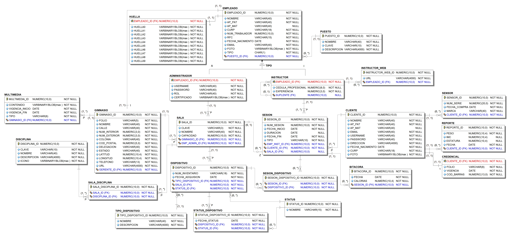

# Proyecto BDA: Vitual GYM

##  Caso de estudio

Virtual Gym es una empresa que cuenta con diversos gimnasios distribuidos en todo el país. Adicional a los servicios que ofrece en cada uno de sus gimnasios, la empresa ha decidido modernizarse a través de un proyecto que permite a sus clientes tomar clases en línea o a distancia, o inclusive en diferentes gimnasios a los que habitualmente acuden. Se registran los siguientes datos de cada gimnasio: folio de 5 caracteres, nombre, dirección, ubicación (latitud y longitud), teléfono principal, página web. Cada Gimnasio cuenta con una serie de contenido multimedia que se emplea para mantener actualizado el sitio web. Este contenido se guarda en la BD: imágenes y videos. A cada archivo se le asigna una vigencia. Posteriormente, el archivo ya no se emplea en el sitio web. Se desea mantener todo este material, aunque ya esté fuera de línea.

Los empleados de Virtual Gym cuentan con un registro único: nombre, apellidos, CURP, número de trabajador, RFC, fecha de nacimiento y puesto el cual proviene de un catálogo (nombre, clave y descripción), email, foto y sus 10 huellas dactilares. Estos datos se emplean entre otras cosas para configurar los accesos en los gimnasios empleando las huellas dactilares. Existe una clasificación de empleados en 2 grupos: Administrativos e Instructores. Para los administradores se almacena login, password, rol de administrador y un archivo binario con extensión .cer (certificado digital) el cual se emplea para acceder al sitio web de administración. Para los instructores se almacena cédula profesional que lo habilita como instructor calificado, años de experiencia, instructor suplente. Cada instructor puede registrar URLs que pueden ser consultadas públicamente para revisar su trayectoria.

Cada gimnasio está formado por un conjunto de salas. Para cada sala se guarda su clave de 3 caracteres, su nombre, capacidad máxima (número de personas), y una lista de las disciplinas que pueden practicarse en dicha sala. Se cuenta con un catálogo de disciplinas: (clave, nombre, descripción, ícono que describe la disciplina empleada como logotipo en documentos, y en el sitio web). Cada sala cuenta con un administrador (empleado). Cada gimnasio cuenta con un gerente.

En cada sala se encuentran una serie de aparatos o dispositivos para realizar rutinas. Se cuenta con un inventario en el que se registra: número de inventario (cadena de 18 caracteres), tipo de dispositivo (se cuenta con catálogo), nombre del dispositivo, fecha de adquisición, y descripción. Para cada dispositivo se han definido una serie de status para administrar su ciclo de vida: vigente, obsoleto, averiado, en reparación, fuera de uso. Se requiere guardar estos estados y su correspondiente historial.

Para el caso de los clientes se cuenta con el siguiente registro: nombre, apellidos, email, username, password, dirección (sin desglosar), fecha de nacimiento, CURP, foto. Con este registro el cliente puede acudir al gimnasio de su preferencia. Se le genera una credencial cuyos datos son: folio de 8 caracteres, vigencia, código de barras empleado para acceder a las salas.

Virtual Gym ofrece a sus clientes la posibilidad de adquirir un sensor que permite medir la cantidad de calorías aproximada que se consumen durante cada una de las sesiones del cliente. Se cuenta con una itácora en la que cada minuto se registra el valor de las calorías que el cliente logra liberar en dicho intervalo. Para cada sesión se guardan los siguientes datos: Número de sesión (folio consecutivo por cliente), fecha de inicio, duración de la sesión, instructor responsable, dispositivo(s) empleado(s) durante la sesión. Virtual Gym permite que los clientes puedan tener sesiones remotas con sus instructores, por ejemplo, el cliente puede realizar una rutina de 30 min en su casa. El sensor reporta los datos de sus calorías sin importar el lugar donde se encuentre. En base de datos se almacena la sala en la que se realiza la sesión o en su defecto se indica el valor “En línea” para los casos en el que el cliente realiza su rutina en casa. Para cada sensor se almacena su número de serie, fecha de compra y marca.

Finalmente, el cliente puede consultar en el sitio web el avance y el resumen de sus sesiones, por ejemplo, el sistema puede mostrarle gráficas en donde se muestra el historial de pérdida de calorías. Para generar reportes más completos, el cliente puede capturar periódicamente los datos de su peso y masa corporal y de ser necesario su estatura. Cada vez que el cliente realiza un ajuste en su peso, masa o inclusive estatura, se agrega un nuevo registro para mantener la historia o evolución de sus medidas.

Requerimientos no funcionales:
<li>Se tiene un aproximado de 5,000 gimnasios distribuidos a lo largo del país.
<li>Se requiere almacenar todas las mediciones de calorías que el cliente genera a lo largo de su estancia en los gimnasios de Virtual Gym.
<li>Se requiere almacenar toda la historia del material multimedia que tiene Virtual Gym para actualizar sus sitios web.
<li>Se requiere capacidad para realizar consultas estadísticas para poder mostrar el avance o progreso de un cliente.
<li>Cada gimnasio ha reportado hasta 1500 usuarios registrados durante un año, existen clientes que realizan hasta 5 rutinas por semana con una duración de hasta 2 hrs.

## Diseño lógico

## Creacion de BD

### Scripts
|Número|Nombre de script|Descripción|
|:----:|:--------------:|:---------:|
|1|[s-01-crea-loop-devices-root](https://github.com/CarlosAEH1/virtualGYM/blob/main/SCRIPTS/s-01-crea-loop-devices-root.sh "s-01-crea-loop-devices-root")|Simula dispositivos de almacenamiento.|
|2|[s-02-crea-pwd-oracle](https://github.com/CarlosAEH1/virtualGYM/blob/main/SCRIPTS/s-02-crea-pwd-oracle.sh "s-02-crea-pwd-oracle")|Crea archivo de passwords.|
|3|[s-03-crea-pfile-oracle](https://github.com/CarlosAEH1/virtualGYM/blob/main/SCRIPTS/s-03-crea-pfile-oracle.sh "s-03-crea-pfile-oracle")|Crea archivo PFILE.|
|4|[s-04-crea-spfile-ordinario](https://github.com/CarlosAEH1/virtualGYM/blob/main/SCRIPTS/s-04-crea-spfile-ordinario.sql "s-04-crea-spfile-ordinario")|Crea archivo SPIFILE.|
|5|[s-05-crea-directorios-root](https://github.com/CarlosAEH1/virtualGYM/blob/main/SCRIPTS/s-05-crea-directorios-root.sh "s-05-crea-directorios-root")|Crea directorios para BD.|
|6|[s-06-crea-bd-ordinario](https://github.com/CarlosAEH1/virtualGYM/blob/main/SCRIPTS/s-06-crea-bd-ordinario.sql "s-06-crea-bd-ordinario")|Crea BD.|
|7|[s-07-crea-diccionario-datos-ordinario](https://github.com/CarlosAEH1/virtualGYM/blob/main/SCRIPTS/s-07-crea-diccionario-datos-ordinario.sql "s-07-crea-diccionario-datos-ordinario")|Crea diccionario de datos.|
|8|[s-08-crea-tablespaces-ordinario](https://github.com/CarlosAEH1/virtualGYM/blob/main/SCRIPTS/s-08-crea-tablespaces-ordinario.sql "s-09-crea-tablespaces-ordinario")|Crea tablespaces.|
|9|[s-09-crea-usuarios-ordinario](https://github.com/CarlosAEH1/virtualGYM/blob/main/SCRIPTS/s-08-crea-tablespaces-ordinario.sql "s-09-crea-usuarios-ordinario")|Crea usuarios y otorga permisos.|

### Configuración inicial
|Configuración|Descripción|
|:-----------:|:---------:|
|Archivos de control|`/unam-bda/d11/app/oracle/oradata/ELROPROY/control01.ctl` `/unam-bda/d12/app/oracle/oradata/ELROPROY/control02.ctl` `/unam-bda/d13/app/oracle/oradata/ELROPROY/control03.ctl`|
|Propuesta de grupos REDO|3 grupos REDO, cada uno contiene 3 Redo Log Files.|
|Propuesta de juego de caracteres|`character set AL32UTF8` `national character set AL16UTF16`|
|Tamaño del bloque de datos|`512K`|
|Parámetros para creacion de BD|`db_name=elroproy` `memory_target=1G` `control_files=(/unam-bda/d11/app/oracle/oradata/ELROPROY/control01.ctl, /unam-bda/d12/app/oracle/oradata/ELROPROY/control02.ctl, /unam-bda/d13/app/oracle/oradata/ELROPROY/control03.ctl)`|
|Archivo de passwords|`sys` `sysbackup`|

### Módulos del sistema
|Nombre del módulo|Descripción|Usuario|
|:---------------:|:---------:|:-----:|
|Gimnasio|Objetos relacionados con la organización e infraestructura del gimnasio.|`gimnasio01`|
|Cliente|Objetos relacionados con la actividad de los clientes.|`cliente01`|

### Esquemas por módulo
|Nombre de la tabla|Nombre del módulo|
|:----------------:|:---------------:|
|`PUESTO`|Gimnasio|
|`EMPLEADO`|Gimnasio|
|`ADMINISTRADOR`|Gimnasio|
|`INSTRUCTOR`|Gimnasio|
|`CLIENTE`|Cliente|
|`GIMNASIO`|Gimnasio|
|`SALA`|Gimnasio|
|`SESION`|Cliente|
|`BITACORA`|Cliente|
|`CREDENCIAL`|Cliente|
|`DISCIPLINA`|Gimnasio|
|`STATUS`|Gimnasio|
|`TIPO_DISPOSITIVO`|Gimnasio|
|`DISPOSITIVO`|Gimnasio|
|`HUELLA`|Gimnasio|
|`INSTRUCTOR_WEB`|Gimnasio|
|`MULTIMEDIA`|Gimnasio|
|`REPORTE`|Cliente|
|`SALA_DISCIPLINA`|Gimnasio|
|`SENSOR`|Cliente|
|`SESION_DISPOSITIVO`|Cliente|
|`STATUS_DISPOSITIVO`|Gimnasio|

### Esquema de indexado
|Módulo|Nombre de la tabla|Nombre del índice|Tipo|Propósito|
|:----:|:----------------:|:---------------:|:--:|:-------:|
|Gimnasio|`PUESTO`|`puesto_clave_ux`|`unique`|Regla de negocio|
|Gimnasio|`EMPLEADO`|`empleado_curp_ux`|`unique`|Regla de negocio|
|Gimnasio|`EMPLEADO`|`empleado_num_trabajador_ux`|`unique`|Regla de negocio|
|Gimnasio|`EMPLEADO`|`empleado_rfc_ux`|`unique`|Regla de negocio|
|Gimnasio|`EMPLEADO`|`empleado_email_ux`|`unique`|Regla de negocio|
|Gimnasio|`ADMINISTRADOR`|`administrador_username_ux`|`unique`|Regla de negocio|
|Gimnasio|`INSTRUCTOR`|`instructor_cedula_profesional_ux`|`unique`|Regla de negocio|
|Cliente|`CLIENTE`|`cliente_email_ux`|`unique`|Regla de negocio|
|Cliente|`CLIENTE`|`cliente_username_ux`|`unique`|Regla de negocio|
|Cliente|`CLIENTE`|`cliente_curp_ux`|`unique`|Regla de negocio|
|Gimnasio|`GIMNASIO`|`gimnasio_folio_ux`|`unique`|Regla de negocio|
|Gimnasio|`GIMNASIO`|`gimnasio_url_ux`|`unique`|Regla de negocio|
|Gimnasio|`SALA`|`sala_clave_ux`|`unique`|Regla de negocio|
|Cliente|`SESION`|`sesion_num_sesion_ux`|`unique`|Regla de negocio|
|Cliente|`SESION`|`sesion_fecha_inicio_ix`|`non unique`|Mejora en desempeño|
|Cliente|`SESION`|`sesion_emp_inst_id_ix`|`non unique`|Mejora en desempeño|
|Cliente|`SESION`|`sesion_cliente_id_ix`|`non unique`|Mejora en desempeño|
|Cliente|`SESION`|`sesion_sala_id_ix`|`non unique`|Mejora en desempeño|
|Cliente|`BITACORA`|`bitacora_fecha_ix`|`non unique`|Mejora en desempeño|
|Cliente|`BITACORA`|`bitacora_sesion_id_ix`|`non unique`|Mejora en desempeño|
|Cliente|`CREDENCIAL`|`credencial_folio_ux`|`unique`|Regla de negocio|
|Cliente|`CREDENCIAL`|`credencial_cod_barras_ux`|`unique`|Regla de negocio|
|Gimnasio|`DISCIPLINA`|`disciplina_clave_ux`|`unique`|Regla de negocio|
|Gimnasio|`DISPOSITIVO`|`dispositivo_num_inventario_ux`|`unique`|Regla de negocio|
|Gimnasio|`DISPOSITIVO`|`dispositivo_status_id_ix`|`non unique`|Mejora en desempeño|
|Gimnasio|`INSTRUCTOR_WEB`|`instructor_web_ux`|`unique`|Regla de negocio|
|Gimnasio|`MULTIMEDIA`|`multimedia_vigencia_fin_ix`|`non unique`|Mejora en desempeño|
|Gimnasio|`MULTIMEDIA`|`multimedia_gimnasio_id_ix`|`non unique`|Mejora en desempeño|
|Cliente|`REPORTE`|`reporte_fecha_ix`|`non unique`|Mejora en desempeño|
|Cliente|`REPORTE`|`reporte_cliente_id_ix`|`non unique`|Mejora en desempeño|
|Cliente|`SENSOR`|`sensor_num_serie_ux`|`unique`|Regla de negocio|
|Cliente|`SESION_DISPOSITIVO`|`sesion_dispositivo_sesion_id_ix`|`non unique`|Mejora en desempeño|
|Cliente|`SESION_DISPOSITIVO`|`sesion_dispositivo_dispositivo_id_ix`|`non unique`|Mejora en desempeño|
|Gimnasio|`STATUS_DISPOSITIVO`|`status_dispositivo_fecha_status_ix`|`non unique`|Mejora en desempeño|
|Gimnasio|`STATUS_DISPOSITIVO`|`status_dispositivo_dispositivo_id_ix`|`non unique`|Mejora en desempeño|
|Gimnasio|`STATUS_DISPOSITIVO`|`status_dispositivo_status_id_ix`|`non unique`|Mejora en desempeño|

## Creación de tablespaces

### Definición de tablespaces comunes
|Nombre de tablespace|Configuración|
|:------------------:|:-----------:|
|`blob_ts`|`smallfile` `1G` `extend management local autoallocate` `segment space management auto` `u01/app/oracle/oradata/ELROPROY/disk03/blob01_df.dbf`, `u01/app/oracle/oradata/ELROPROY/disk04/blob02_df.dbf`|

### Definición de tablespaces comunes
|Modulo|Nombre de tablespace|Objetivo|Configuracion|
|:----:|:------------------:|:------:|:-----------:|
|Gimnasio|`instalaciones_ts`|Almacenar registros de sitio fisico y digital del gimnasio.|`bigfile` `512M` `extend management local autoallocate` `segment space management auto` `u01/app/oracle/oradata/ELROPROY/disk05/instalaciones_df.dbf`|
|Gimnasio|`salas_ts`|Almacenar registros de disciplinas disponibles por sala.|`bigfile` `512M` `extend management local autoallocate` `segment space management auto` `u01/app/oracle/oradata/ELROPROY/disk06/salas_df.dbf`|
|Gimnasio|`inventario_ts`|Almacenar registros de estado de dispositivo.|`bigfile` `1G` `extend management local autoallocate` `segment space management auto` `u01/app/oracle/oradata/ELROPROY/disk07/inventario_df.dbf`|
|Gimnasio|`empleados_ts`|Almacenar registros de la organizacion.|`bigfile` `1G` `extend management local autoallocate` `segment space management auto` `u01/app/oracle/oradata/ELROPROY/disk08/empleados_df.dbf`|
|Gimnasio|`huellas_ts`|Optimizar consultas a tabla EMPLEADO.|`bigfile` `512M` `extend management local autoallocate` `segment space management auto` `u01/app/oracle/oradata/ELROPROY/disk09/huellas_df.dbf`|
|Cliente|`clientes_ts`|Almacenar registros de usuario.|`bigfile` `512M` `extend management local autoallocate` `segment space management auto` `u01/app/oracle/oradata/ELROPROY/disk10/clientes_df.dbf`|
|Cliente|`sesiones_ts`|Almacenar registros de actividad de usuario.|`bigfile` `1G` `extend management local autoallocate` `segment space management auto` `u01/app/oracle/oradata/ELROPROY/disk11/sesiones_df.dbf`|
|Cliente|`historial_ts`|Almacenar registros históricos de usuario.|`smallfile` `1G` `extend management local autoallocate` `segment space management auto` `u01/app/oracle/oradata/ELROPROY/disk12/historial01_df.dbf`, `u01/app/oracle/oradata/ELROPROY/disk13/historial02_df.dbf`|

### Asignación de tablespace por objeto y módulo
|Módulo|Tipo de segmento|Nombre de segmento|Nombre de tablespace|
|:----:|:--------------:|:----------------:|:------------------:|
|Gimnasio|Tabla|`PUESTO`|`empleados_ts`|
|Gimnasio|Índice|`puesto_clave_ux`|`indice_ts`|
|Gimnasio|Tabla|`EMPLEADO`|`empleados_ts`|
|Gimnasio|Índice|`empleado_curp_ux`|`indice_ts`|
|Gimnasio|Índice|`empleado_num_trabajador_ux`|`indice_ts`|
|Gimnasio|Índice|`empleado_rfc_ux`|`indice_ts`|
|Gimnasio|Índice|`empleado_email_ux`|`indice_ts`|
|Gimnasio|Columna|`empleado_foto`|`blob_ts`|
|Gimnasio|Tabla|`ADMINISTRADOR`|`empleados_ts`|
|Gimnasio|Índice|`administrador_username_ux`|`indice_ts`|
|Gimnasio|Columna|`administrador_certificado`|`blob_ts`|
|Gimnasio|Tabla|`INSTRUCTOR`|`empleados_ts`|
|Gimnasio|Índice|`instructor_cedula_profesional_ux`|`indice_ts`|
|Cliente|Tabla|`CLIENTE`|`clientes_ts`|
|Cliente|Índice|`cliente_email_ux`|`indice_ts`|
|Cliente|Índice|`cliente_username_ux`|`indice_ts`|
|Cliente|Índice|`cliente_curp_ux`|`indice_ts`|
|Cliente|Columna|`cliente_foto`|`blob_ts`|
|Gimnasio|Tabla|`GIMNASIO`|`instalaciones_ts`|
|Gimnasio|Índice|`gimnasio_folio_ux`|`indice_ts`|
|Gimnasio|Índice|`gimnasio_url_ux`|`indice_ts`|
|Gimnasio|Tabla|`SALA`|`salas_ts`|
|Gimnasio|Índice|`sala_clave_ux`|`indice_ts`|
|Cliente|Tabla|`SESION`|`sesiones_ts`|
|Cliente|Índice|`sesion_num_sesion_ux`|`indice_ts`|
|Cliente|Índice|`sesion_fecha_inicio_ix`|`indice_ts`|
|Cliente|Índice|`sesion_emp_inst_id_ix`|`indice_ts`|
|Cliente|Índice|`sesion_cliente_id_ix`|`indice_ts`|
|Cliente|Índice|`sesion_sala_id_ix`|`indice_ts`|
|Cliente|Tabla|`BITACORA`|`historial_ts`|
|Cliente|Índice|`bitacora_fecha_ix`|`indice_ts`|
|Cliente|Índice|`bitacora_sesion_id_ix`|`indice_ts`|
|Cliente|Tabla|`CREDENCIAL`|`clientes_ts`|
|Cliente|Índice|`credencial_folio_ux`|`indice_ts`|
|Cliente|Índice|`credencial_cod_barras_ux`|`indice_ts`|
|Gimnasio|Tabla|`DISCIPLINA`|`salas_ts`|
|Gimnasio|Índice|`disciplina_clave_ux`|`indice_ts`|
|Gimnasio|Columna|`disciplina_icono`|`blob_ts`|
|Gimnasio|Tabla|`STATUS`|`inventario_ts`|
|Gimnasio|Tabla|`TIPO_DISPOSITIVO`|`inventario_ts`|
|Gimnasio|Índice|`tipo_dispositivo_id`|`indice_ts`|
|Gimnasio|Tabla|`DISPOSITIVO`|`inventario_ts`|
|Gimnasio|Índice|`dispositivo_num_inventario_ux`|`indice_ts`|
|Gimnasio|Índice|`dispositivo_status_id_ix`|`indice_ts`|
|Gimnasio|Tabla|`HUELLA`|`huellas_ts`|
|Gimnasio|Columna|`huella`|`blob_ts`|
|Gimnasio|Columna|`huella1`|`blob_ts`|
|Gimnasio|Columna|`huella2`|`blob_ts`|
|Gimnasio|Columna|`huella3`|`blob_ts`|
|Gimnasio|Columna|`huella4`|`blob_ts`|
|Gimnasio|Columna|`huella5`|`blob_ts`|
|Gimnasio|Columna|`huella6`|`blob_ts`|
|Gimnasio|Columna|`huella7`|`blob_ts`|
|Gimnasio|Columna|`huella8`|`blob_ts`|
|Gimnasio|Columna|`huella9`|`blob_ts`|
|Gimnasio|Tabla|`INSTRUCTOR_WEB`|`empleados_ts`|
|Gimnasio|Índice|`instructor_web_ux`|`indice_ts`|
|Gimnasio|Tabla|`MULTIMEDIA`|`instalaciones_ts`|
|Gimnasio|Índice|`multimedia_vigencia_fin_ix`|`indice_ts`|
|Gimnasio|Índice|`multimedia_gimnasio_id_ix`|`indice_ts`|
|Gimnasio|Columna|`multimedia_contenido`|`blob_ts`|
|Cliente|Tabla|`REPORTE`|`historial_ts`|
|Cliente|Índice|`reporte_fecha_ix`|`indice_ts`|
|Cliente|Índice|`reporte_cliente_id_ix`|`indice_ts`|
|Gimnasio|Tabla|`SALA_DISCIPLINA`|`salas_ts`|
|Gimnasio|Índice|`sala_disciplina_id`|`indice_ts`|
|Cliente|Tabla|`SENSOR`|`clientes_ts`|
|Cliente|Índice|`sensor_num_serie_ux`|`indice_ts`|
|Cliente|Tabla|`SESION_DISPOSITIVO`|`sesiones_ts`|
|Cliente|Índice|`sesion_dispositivo_sesion_id_ix`|`indice_ts`|
|Cliente|Índice|`sesion_dispositivo_dispositivo_id_ix`|`indice_ts`|
|Gimnasio|Tabla|`STATUS_DISPOSITIVO`|`inventario_ts`|
|Gimnasio|Índice|`status_dispositivo_fecha_status_ix`|`indice_ts`|
|Gimnasio|Índice|`status_dispositivo_dispositivo_id_ix`|`indice_ts`|
|Gimnasio|Índice|`status_dispositivo_status_id_ix`|`indice_ts`|

## Creación de usuarios

|Nombre de usuario|Default tablespace|Default temporary tablespace|Default undo tablespace|Privilegios asignados|
|:---------------:|:----------------:|:--------------------------:|:---------------------:|:-------------------:|
|`gimnasio01`|`gimnasios_ts`|`temp_ts`|`undo_ts`|`create session` `create table` `create sequence` `create procedure` `create trigger` `create synonym` `create view`|
|`cliente01`|`clientes_ts`|`temp_ts`|`undo_ts`|`create session` `create table` `create sequence` `create procedure` `create trigger` `create synonym` `create view`|
